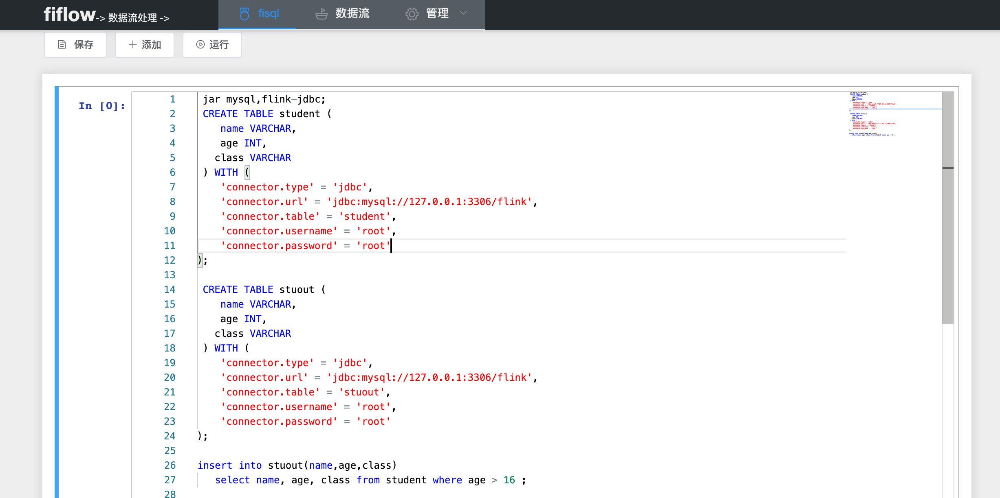

dev1
# 基于flink的数据流处理系统 
      基于 apache flink1.10

## 如何运行
-  运行  FiflowWebMain 
-  访问  http://localhost:9090/fiflow 

## 如何使用 
在输入框中输入 help 给出提示信息;

- demo mysql    :  jdbc 示例
- demo kafka    :  kafka 示例
- demo elasticsearch : elasticsearch 示例
- demo mysql-binlog :  mysql-binlog 示例 doing

## 模块划分
- fiflow-ui       web页面 sql的执行 和 任务的创建 管理
- fiflow-web      与前端对应的后台
- fiflow-api      fiflow 对外提供的操作api 
- fiflow-core     flink 操作的封装
- fiflow-io       输入 输出 
- fiflow-runtime  提交任务到flink  local、standalone、yarn 以及与flink集群的交互

## fiflow-io
- [Elasticsearch](./fiflow-io/fiflow-elasticsearch7/README.md) 读写
    >  支持谓词下推和异步维表join, 按 shard 分片读取数据  
       支持append和retract写(90% complete)
    
- mysql binlog doing 
- hbase todo 
- ... todo

## todo
- flink 集群管理 
- 任务管理 
- 使用 数据源管理功能 取代 create table 操作

## Thanks 
- flink
- zeppelin 
- spring boot 
- flinkx 
- vue 
- element-ui 
